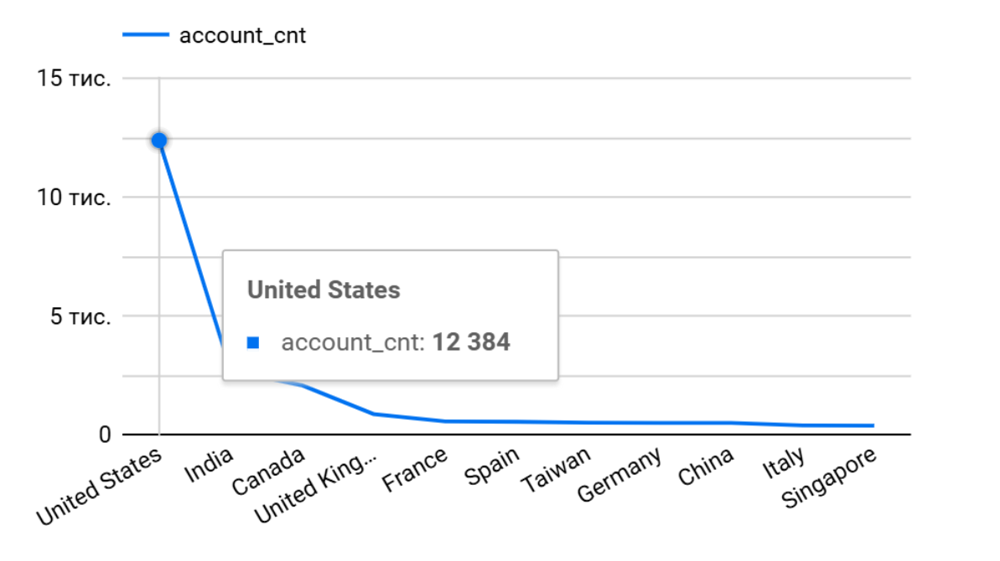
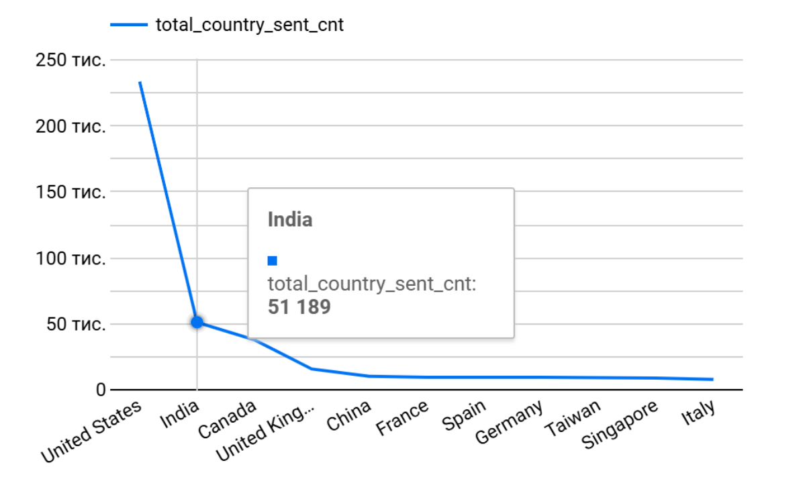
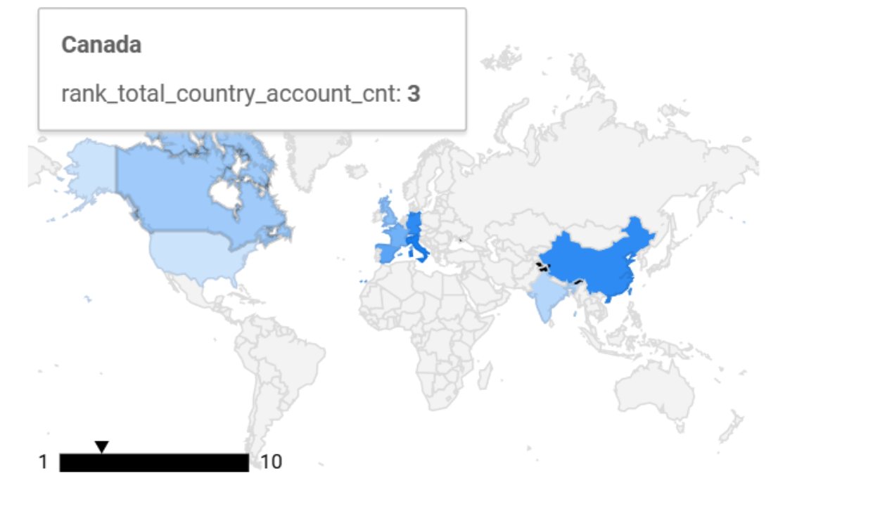

# Product Analytics: User Activity & Email Metrics Analysis

## 📊 Project Overview
This project contains a comprehensive SQL query for product metrics analysis. The query combines account registration data with email campaign results, grouping them by geography, time intervals, and subscription statuses.

## Key SQL Features & Techniques
This analysis demonstrates advanced SQL proficiency through the use of:
* **Common Table Expressions (CTEs):** Structured for readability and modular data processing (e.g., `account_metrics`, `email_metrics`).
* **Data Integration:** Using `UNION ALL` to merge disparate datasets into a unified analytical layer.
* **Advanced Window Functions:** * `SUM(...) OVER (PARTITION BY country)` to calculate global market totals while maintaining granular row details.
    * `DENSE_RANK() OVER (ORDER BY ... DESC)` to dynamically rank top-performing countries by subscriber volume and engagement.
* **Complex Joins:** Utilizing `LEFT JOIN` and `INNER JOIN` across multiple tables (`account`, `session`, `email_sent`, etc.) to build a 360-degree user view.
* **Time-Series Analysis:** Aggregating data by date and calculating message delivery intervals.

## Analysis Dimensions
The query provides insights into:
1.  **Geography:** Market ranking by total account count and email activity.
2.  **User Status:** Breakdown by verification status (`is_verified`) and subscription status (`is_unsubscribed`).
3.  **Engagement Metrics:** Tracking Sent, Opened, and Visited (click-through) counts for email campaigns.

### 📈 Visualizations / Візуалізації
#### User Distribution by Country

#### Total Emails Sent by Country

#### Email Sending Dynamics Over Time

##  Results 
* [📄 View CSV file](./product_analytics_results.csv)
* [📄 View results (Google Drive)](https://drive.google.com/file/d/1wnyJWVQnCX83BSHSrSvPVoedENUxXrQO/view?usp=sharing)
---
**Note:** The data processed in this project is for analytical demonstration purposes, showcasing the ability to handle large-scale relational datasets in a cloud environment.
